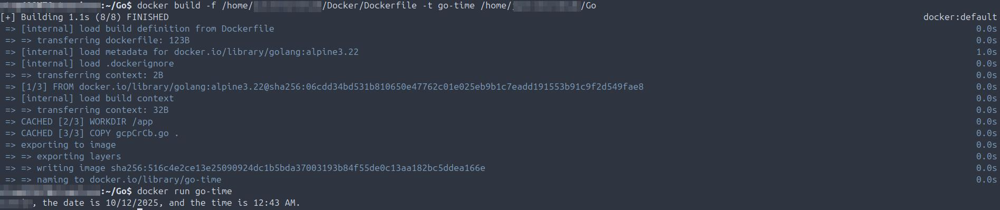
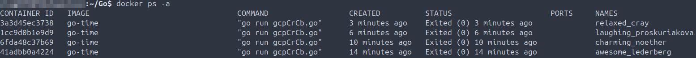
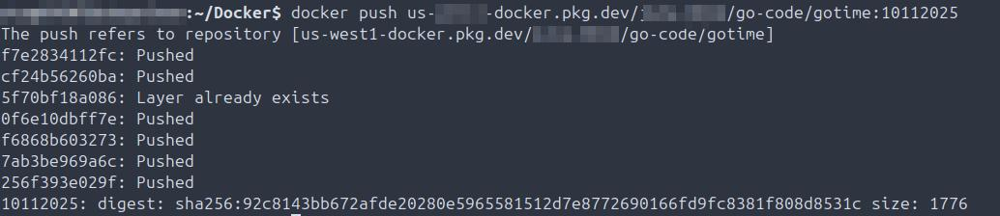
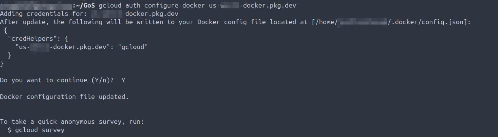
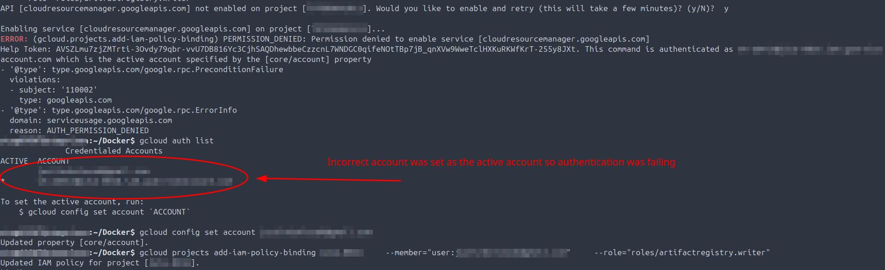
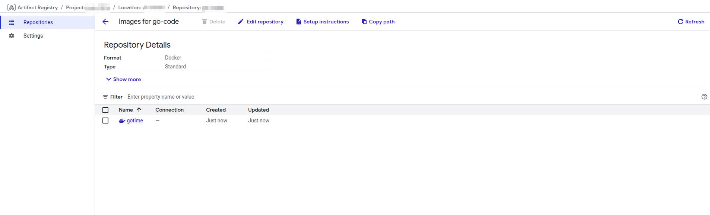
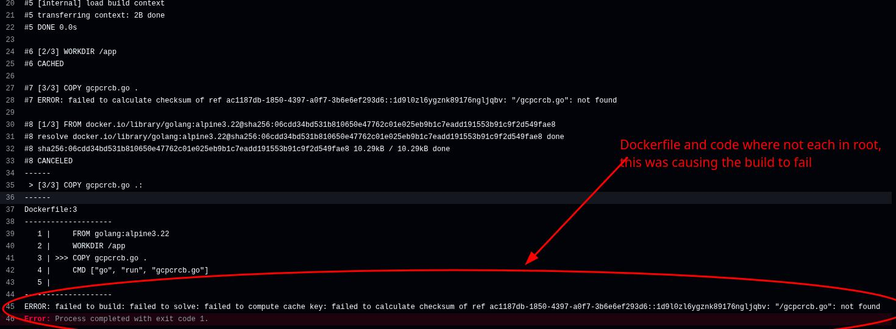
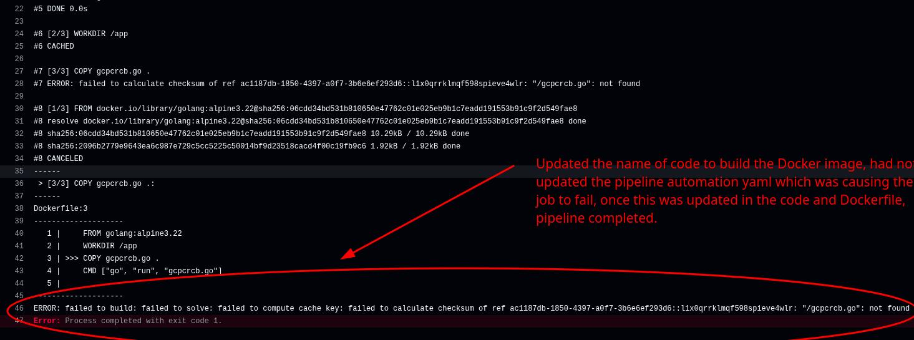

## Troubleshooting Callout
Artifacts of smoke testing pipeline build, includes troubleshooting.

## Pipeline Build
**Summary:** Write code -> build docker image -> test code locally -> create repo -> test and debug pipeline -> clone repo and test locally.

- 2025-10-11 Build docker image and run.
  
- 2025-08-17 Validate container ran and returned RC0.
  
- 2025-08-17 Push image to GCP Artifact Repository.
  
- 2025-08-17 Authorize Docker to connect to Artifact Repo using gcloud shell.
  
- 2025-08-17 TROUBLESHOOT: The incorrect account was set as active, cuasing authentication to fail when trying to push the docker image to GCP Artifact Repo. Corrected by changing and validating the correct active account.
  
- 2025-08-17 Validate docker image is now in Artifact Repo in GCP.
  
- 2025-08-17 TROUBLESHOOT: Dockerfile and Go code where not both in root, which was causing the build to fail.
  
- 2025-08-17 TROUBLESHOOT: Updated the name of the code used to build the Docker image, did not update the build yaml or the code itself, which was causing the build to fail. Once everything was uniform build ran to completion returning an RC0.
  
