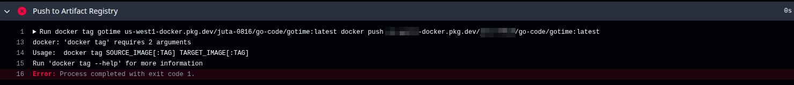
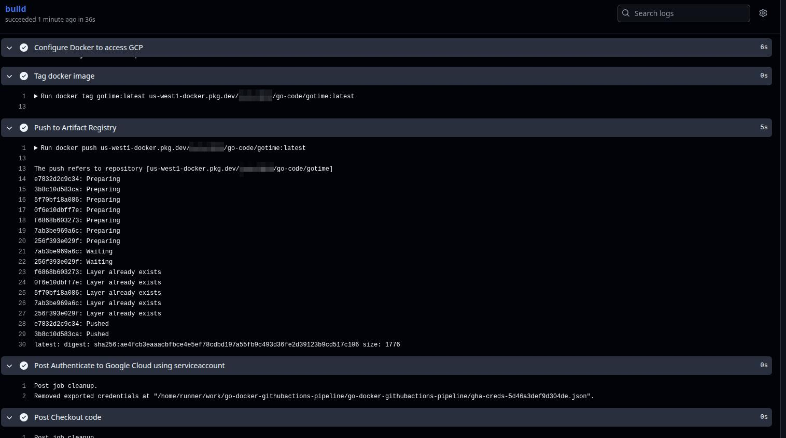
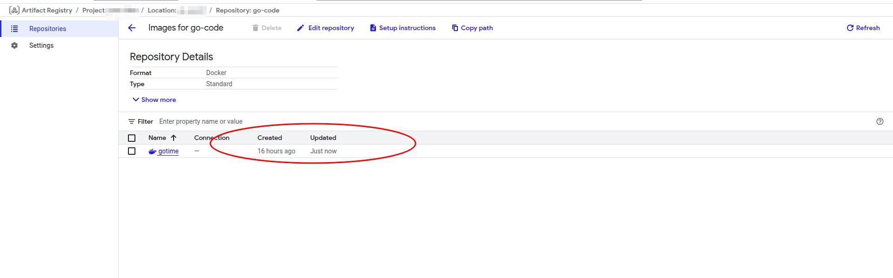

## Troubleshooting Callout
Artifacts of smoke testing pipeline build, includes troubleshooting.

## Pipeline Build
**Summary:** Write code -> build docker image -> test code locally -> create repo -> test and debug pipeline -> clone repo and test locally.

- 2025-10-11 Build docker image and run container.
  
- 2025-10-11 Validate container ran and returned RC0.
  
- 2025-10-11 Push Docker Image to GCP Artifact Repository.
  
- 2025-10-11 Authorize Docker to connect to Artifact Repo using gcloud shell.
  
- 2025-11-11 TROUBLESHOOT: The incorrect account was set as active, causing authentication to fail when trying to push the Docker Image to GCP Artifact Repo. Corrected by changing and validating the correct active account.
  
- 2025-10-11 Validate Docker Image is now in Artifact Registry in GCP.
  
- 2025-10-11 TROUBLESHOOT: Dockerfile and Go code were not both in root. 
  
- 2025-10-11 TROUBLESHOOT: Updated the name of the code used to build the Docker Image, did not update the build yaml or the code itself, which was causing the build to fail. Once everything was uniform build ran to completion returning an RC0.
  
- 2025-10-12 TROUBLESHOOT: Job failing due to the source image not being properly tagged prior to pushing the Docker Image from GitHub Actions to GCP Artifact Repo. Corrected tagging the image earlier in the build process, adding a unit test job, and breaking up the tag and push job from one to two jobs. Final smoke test performed by validating image updated in Artifact Repo.
  
  
  

  ## Result: End-to-end pipeline validated; image builds, tags, and pushes successfully from GitHub Actions to GCP Artifact Registry.
